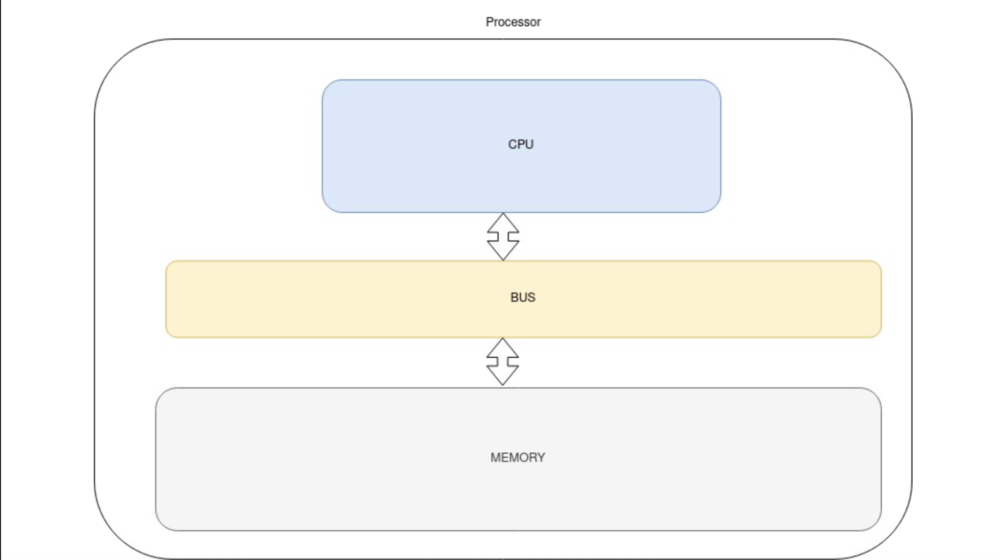
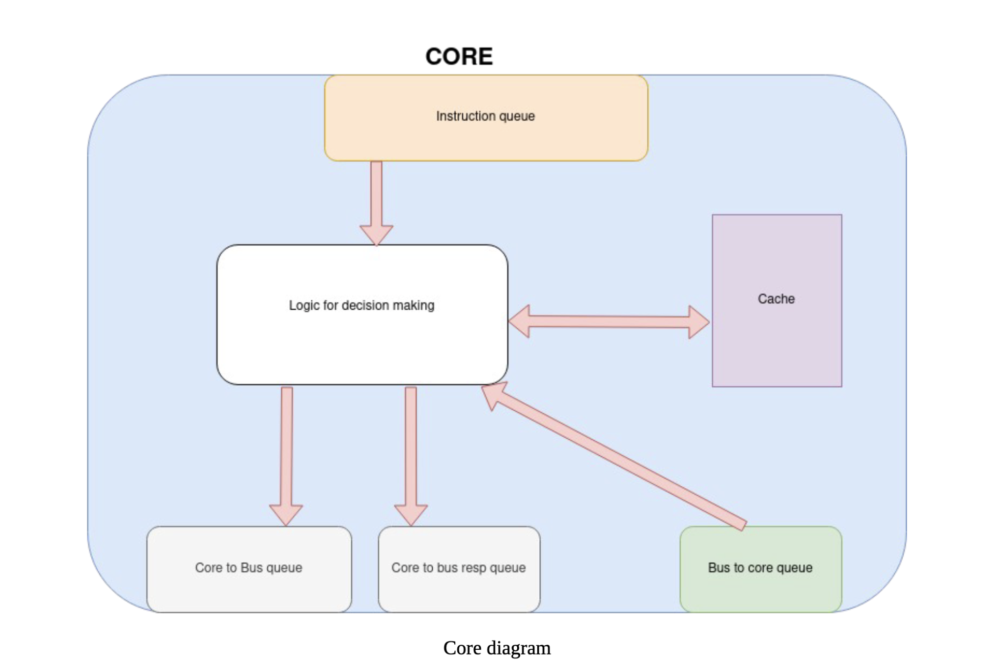
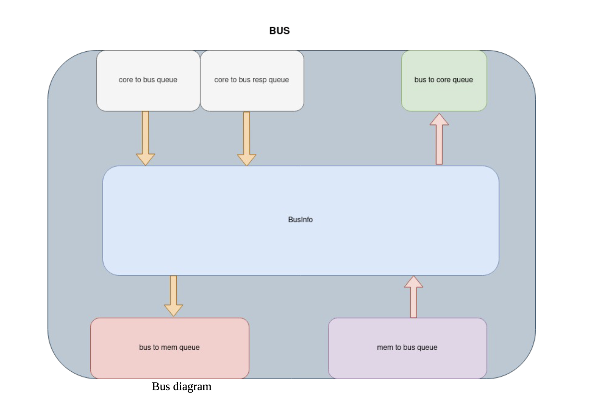
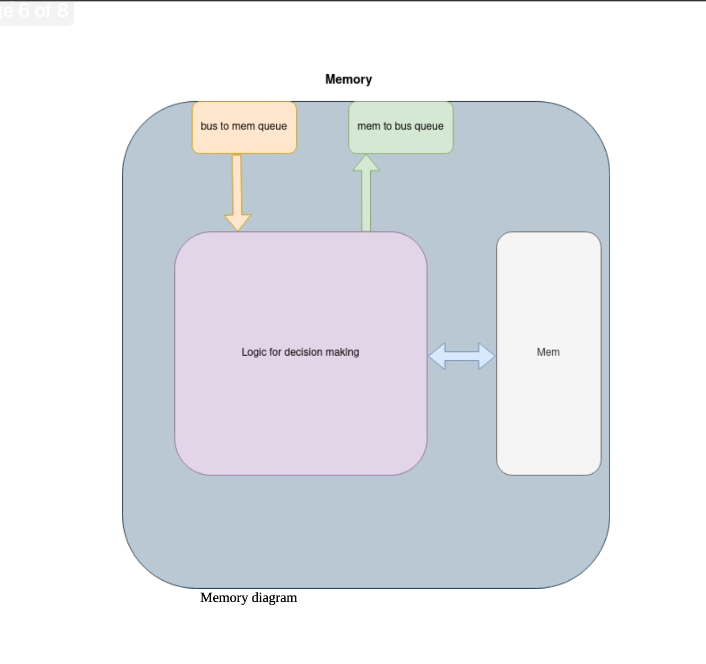

# Bus based MOESI Coherency Protocol Implementation

This code implements bus based coherency protocol (MOESI). It consist of eight-core CPU, bus and memory implemented using C++ classes.

Following are directory description:

1) doc: Contains few documentation about detail of implementation. Also contains json files for debugging in VS Code.
   There are flow diagrams for certain scenarios added to understand the code.

2) input: This file contains test file in txt format and have list of instructions to be implemented.

3) src: This directory contains source code for various components: cpu, core, bus, perf_param, processor etc.

4) test: This directory contains test file in cpp format. Currently sys_test.hpp is used.

5) coherentProtocol.cpp: This is the top level file which calls sys_test() function and take filename/verbosity from user and pass it to sys_test.

6) run.tcl: This is the compile command. Run 'source run.tcl' to compile the code.

7) Params.txt: This file contains parameter deteriming size of buffers. Using this file is optional since there is default buffer size setting in the code.

## Running the code

There are two argumets that need to be provided:

1) input file (string)

2) verbosity (can be 0 or 1. provided with '-v' switch)

If input/simple_read with verbosity set to false, run the code by typing following commands (first command is for compilation):

> source run.tcl

> ./CoherentProtocol input/simple_read.txt -v 0

Setting verbosity to 1 enables debug print statement which can be used to understand what events are occuring in each clock cycle.

## Block Diagram

1) Processor

2) Core

3) Bus

4) Memory

Details about how above modules interact is there in the doc directory.
